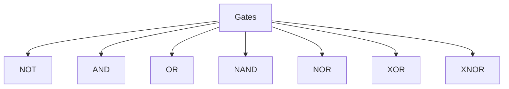
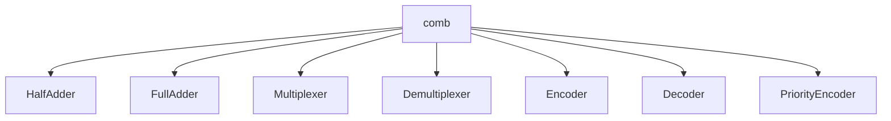
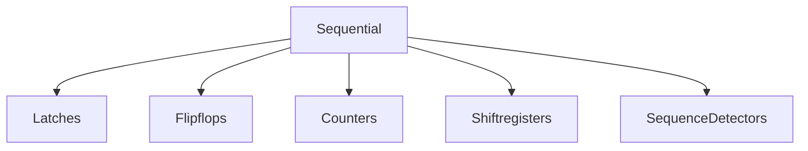
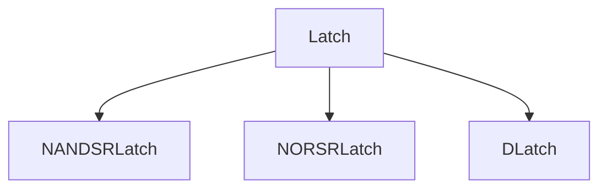
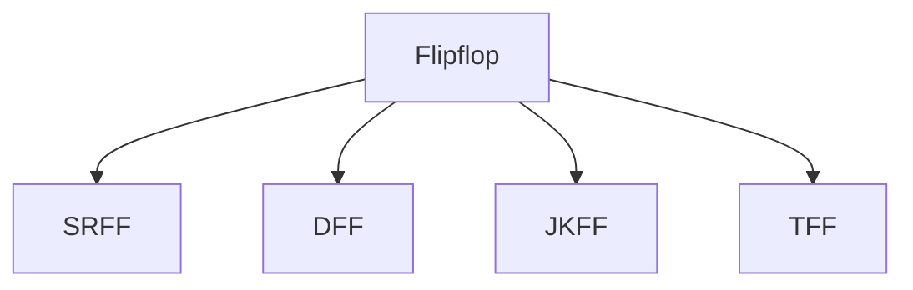
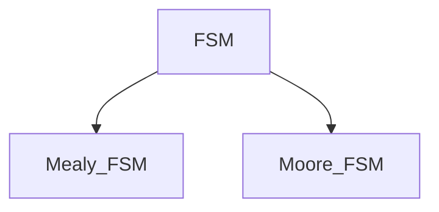

# Verilog HDL
This repository contains all the Verilog code of combinational and sequential circuits.

## 1. Basic Gates 

The basic gates are : 

- y[0] represents the NOT operation of a
- y[1] represents the AND operation of a and b
- y[2] represents the OR operation of a and b
- y[3] represents the NAND operation of a and b
- y[4] represents the NOR operation of a and b
- y[5] represents the XOR operation of a and b
- y[6] represents the XNOR operation of a and b

The simulation waveforms of the basic gates are shown in - ([OUTPUT](https://github.com/SrujanPrasad/Verilog-HDL-basics/blob/9c629b2cce5f6b5224f43adf19c60b91f20ffe08/Basic%20Gates/Basic_gates.png)) and ([Waveforms](https://github.com/SrujanPrasad/Verilog-HDL-basics/blob/9c629b2cce5f6b5224f43adf19c60b91f20ffe08/Basic%20Gates/Basic_gates_waveforms.png))

## 2. Combinational Circuits 

### Half Adder :
  The Verilog code for a half adder has been written in three modelling styles -  Structural/Gate level, Dataflow, and Behavioural modelling. ([HALF_ADDER](https://github.com/SrujanPrasad/Verilog-HDL-basics/tree/9c629b2cce5f6b5224f43adf19c60b91f20ffe08/Comb/half_adder))
    
 
  **Truth Table** :

| A | B | Sum | Carry |
|:-:|:-:|:---:|:----:|
| 0 | 0 |  0  |  0   |
| 0 | 1 |  1  |  0   |
| 1 | 0 |  1  |  0   |
| 1 | 1 |  0  |  1   |

### Full Adder : 
The Verilog code for a half adder has been written in three modelling styles -  Structural/Gate level, Dataflow, and Behavioural modelling. ([FULL_ADDER](https://github.com/SrujanPrasad/Verilog-HDL-basics/tree/9c629b2cce5f6b5224f43adf19c60b91f20ffe08/Comb/full_adder))

   
 
  **Truth Table** :
| A | B | Cin | Sum | Carry |
|:-:|:-:|:---:|:---:|:----:|
| 0 | 0 |  0  |  0  |  0   |
| 0 | 0 |  1  |  1  |  0   |
| 0 | 1 |  0  |  1  |  0   |
| 0 | 1 |  1  |  0  |  1   |
| 1 | 0 |  0  |  1  |  0   |
| 1 | 0 |  1  |  0  |  1   |
| 1 | 1 |  0  |  0  |  1   |
| 1 | 1 |  1  |  1  |  1   |

The simulation waveforms of both Half Adder and Full Adder are shown here : ([Half_adder_waveforms](https://github.com/SrujanPrasad/Verilog-HDL-basics/blob/9c629b2cce5f6b5224f43adf19c60b91f20ffe08/Comb/half_adder/half_adder_waveform.png)) ([Full_adder_waveforms](https://github.com/SrujanPrasad/Verilog-HDL-basics/blob/9c629b2cce5f6b5224f43adf19c60b91f20ffe08/Comb/full_adder/full_adder_waveforms.png))

### 2:1 MUX 
The 2:1 mux is a data selection circuit that selects between the inputs based on the select line (consists of **2 inputs ,one select line and 1 output**) and connects it to the output. The codes and simulation results are in : ([21MUX](https://github.com/SrujanPrasad/Verilog-HDL-basics/tree/e53a532845ced5043de5e60925aef1d0a915a8f9/Comb/21_MUX))

### 4:1 MUX 
The 4:1 mux is a data selection circuit that selects between the inputs based on the select line (consists of **4 inputs, two select lines and 1 output**) and connects it to the output. The codes and simulation results are in : ([41MUX](https://github.com/SrujanPrasad/Verilog-HDL-basics/tree/e53a532845ced5043de5e60925aef1d0a915a8f9/Comb/41_mux))

### 8:1 MUX 
The 8:1 mux is a data selection circuit that selects between the inputs based on the select line (consists of **8 inputs, three select lines and 1 output**) and connects it to the output. The codes and simulation results are in : ([81MUX](https://github.com/SrujanPrasad/Verilog-HDL-basics/tree/e53a532845ced5043de5e60925aef1d0a915a8f9/Comb/81_mux))

### Demux 
The demultiplexer is a combinational circuit that has 1 input and n outputs with log base 2 (n) select lines. The codes and simulation results are in : ([DEMUX](https://github.com/SrujanPrasad/Verilog-HDL-basics/tree/e53a532845ced5043de5e60925aef1d0a915a8f9/Comb/demux))

### Encoder 
The encoder is a combinational circuit consisting of n inputs and m outputs (n<m) that encodes the data to be transmitted into its binary form. The codes and simulation results are in : ([ENCODERS](https://github.com/SrujanPrasad/Verilog-HDL-basics/tree/e53a532845ced5043de5e60925aef1d0a915a8f9/Comb/Encoder))

### Decoder 
The decoder is a combinational circuit that consists of n inputs and m outputs (n>m) and decodes the data transmitted into its binary form. The codes and simulation results are in : ([DECODERS](https://github.com/SrujanPrasad/Verilog-HDL-basics/tree/e53a532845ced5043de5e60925aef1d0a915a8f9/Comb/decoder))

## 3. Sequential Circuits 

### Latches :
- The latch operates based on the control/enable signal. It is a level-triggered one-bit memory element.
- The latches simulated here are : 

The codes and simulation results of all the latches above are in : ([Latches](https://github.com/SrujanPrasad/Verilog-HDL-basics/tree/564910a31cb35bb47f6bbac18c264e7056536dc3/sequential%20circuits/latches))

### Flip Flops:
- The combination of master and slave latches forms a flip-flop, and they operate based on the clock signal. It is an edge-triggered one-bit memory element.
- The flip flops simulated here are : 

**SR FLIP FLOP** :

   
 
  **Truth Table** :
| CLK| S | R | Q | Qb|
|:-:|:-:|:---:|:---:|:----:|
| 0 | x |  x  |  Qn  |  Qn_b   |
| 1 | 0 |  0  |  Qn  |  Qn_b    |
| 1 | 0 |  1  |  0  |  1   |
| 1 | 1 |  0  |  1  |  0   |
| 1 | 1 |  1  |  x  |  x   |

**D FLIP FLOP** :

   
 
  **Truth Table** :
| CLK| D | Q | Qb | 
|:-:|:-:|:---:|:---:|
| 0 | x |  Qn  |  Qnb 
| 1 | 0 |  0  |  1 
| 1 | 1 |  1  |  0 

**JK FLIP FLOP** :

   
 
  **Truth Table** :
| CLK| J | K | Q | Qb|
|:-:|:-:|:---:|:---:|:----:|
| 0 | x |  x  |  Qn  |  Qn_b   |
| 1 | 0 |  0  |  Qn  |  Qn_b    |
| 1 | 0 |  1  |  0  |  1   |
| 1 | 1 |  0  |  1  |  0   |
| 1 | 1 |  1  |  Qnb  |  Qn   |

**T FLIP FLOP** :

   
 
  **Truth Table** :
| CLK| D | Q | Qb | 
|:-:|:-:|:---:|:---:|
| 0 | x |  Qn  |  Qnb 
| 1 | 0 |  Qn  |  Qnb 
| 1 | 1 |  Qnb  |  Qn

The codes and simulation results of all the flip-flops above are in : ([flipflops](https://github.com/SrujanPrasad/Verilog-HDL-basics/tree/564910a31cb35bb47f6bbac18c264e7056536dc3/sequential%20circuits/flipflops))

### Counters 
A counter is a simple counting circuit that either counts upwards or downwards or both ways based on mode control. 
There are two types: Upcounters and Downcounters

The codes and simulation results of all the types of counters are in : ([counters](https://github.com/SrujanPrasad/Verilog-HDL-basics/tree/27fcb2770a879dde1f5258439ebb4b5fa8b172cf/sequential%20circuits/counters))

### Sequence Detectors 
The sequence detectors detect a particular sequence from a bit stream of inputs. There are two types of FSMs : 

- Mealy FSM- Output depends on the present state and inputs.
- Moore FSM -  output depends only on the present state.

The codes and simulation results of all the sequence detectors are in : ([Sequence_Detectors](https://github.com/SrujanPrasad/Verilog-HDL-basics/tree/27fcb2770a879dde1f5258439ebb4b5fa8b172cf/sequential%20circuits/sequence%20detectors))
