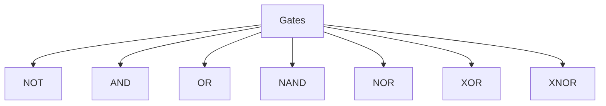
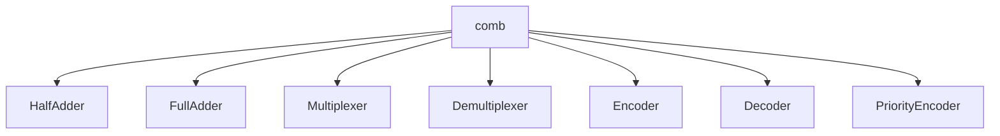

# Verilog HDL
This repository contains all the verilog codes of combinational and seqeuntial circuits along with some applications.

## 1. Basic Gates 

The basic gates are : 

- y[0] represents the NOT operation of a
- y[1] represents the AND operation of a and b
- y[2] represents the OR operation of a and b
- y[3] represents the NAND operation of a and b
- y[4] represents the NOR operation of a and b
- y[5] represents the XOR operation of a and b
- y[6] represents the XNOR operation of a and b

## 2. Combinational Circuits 

